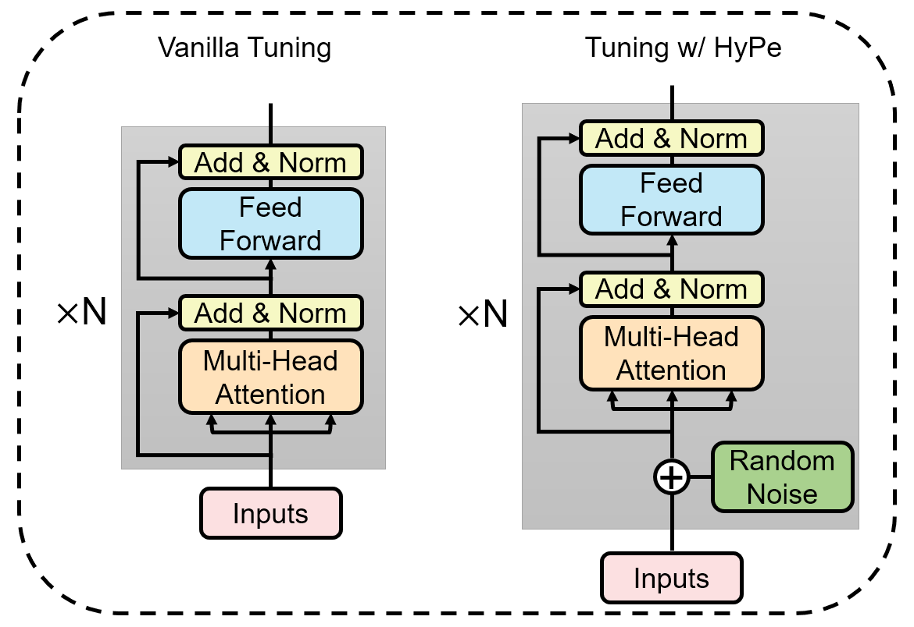

# HyPe: Better PLM Fine-tuning with Hidden Representation Perturbation


## Overviews

This is the repository for ACL2023 main conference paper: **HyPe** (HyPe: Better Pre-trained Language Model Fine-tuning with Hidden Representation Perturbation). You can find our paper on [ArXiv](https://arxiv.org/abs/2212.08853) or on [ACL Anthology](https://aclanthology.org/2023.acl-long.182/).

Language models with the Transformers structure have shown great performance in natural language processing.
However, there still poses problems when fine-tuning pre-trained language models on downstream tasks, such as over-fitting or representation collapse.
In this work, we propose HyPe, a simple yet effective fine-tuning technique to alleviate such problems by perturbing hidden representations of Transformers layers. Unlike previous works that only add noise to inputs or parameters, we argue that the hidden representations of Transformers layers convey more diverse and meaningful language information. 
Therefore, making the Transformers layers more robust to hidden representation perturbations can further benefit the fine-tuning of PLMs en bloc.
We conduct extensive experiments and analyses on GLUE and other natural language inference datasets. Results demonstrate that HyPe outperforms vanilla fine-tuning and enhances generalization of hidden representations from different layers. In addition, HyPe acquires negligible computational overheads, and is better than and compatible with previous state-of-the-art fine-tuning techniques.

<center>
    <a target="_blank"></a>
    <br>
    <div style="color:orange; border-bottom: 1px solid #d9d9d9;
    display: inline-block;
    color: #999;
    padding: 2px;">Method Overview.</div>
</center>

## Requirements

- python==3.7
- cuda==10.1
- torch==1.8.0

- transformers==4.7.0
- datasets==1.6.0
- scikit-learn==0.24.2

## How to train and evaluate using HyPe

You can use the following Shell script to run HyPe fine-tuning on GLUE benchmark.

```
mkdir ./final_results

GPU=<your GPU id>
OUTPUT_DIR=<your output directory path>
MODEL=<your PLM to fine-tune>
TASK=rte
BATCHSIZE=16
EPOCH=3.0
LR=2e-5
SEED=42

CUDA_VISIBLE_DEVICES=${GPU} python main.py \
        --adam_epsilon 1e-6 \
        --max_seq_length 128 \
        --eval_accumulation_steps 20 \
        --do_eval \
        --do_train \
        --warmup_ratio 0.1 \
        --weight_decay 0.01 \
        --save_total_limit 1 \
        --save_steps 30000 \
        --model_name_or_path ${MODEL} \
        --task_name ${TASK} \
        --per_device_train_batch_size ${BATCHSIZE} \
        --learning_rate ${LR} \
        --num_train_epochs ${EPOCH} \
        --seed ${SEED} \
        --output_dir ${OUTPUT_DIR} \
        --low_resource \
        --dropout_rate 0.0 \
        --hype_type uniform \
        --hype_eps 1e-5 \

```

You can modify the following three args to explore different settings of HyPe:
- --hype_type # should be one of {normal, uniform}
- --hype_eps

## Citation
If you find our work useful, please cite:

```
@inproceedings{yuan-etal-2023-hype,
    title = "{H}y{P}e: Better Pre-trained Language Model Fine-tuning with Hidden Representation Perturbation",
    author = "Yuan, Hongyi  and
      Yuan, Zheng  and
      Tan, Chuanqi  and
      Huang, Fei  and
      Huang, Songfang",
    booktitle = "Proceedings of the 61st Annual Meeting of the Association for Computational Linguistics (Volume 1: Long Papers)",
    month = jul,
    year = "2023",
    address = "Toronto, Canada",
    publisher = "Association for Computational Linguistics",
    url = "https://aclanthology.org/2023.acl-long.182",
    pages = "3246--3264",
    abstract = "Language models with the Transformers structure have shown great performance in natural language processing.However, there still poses problems when fine-tuning pre-trained language models on downstream tasks, such as over-fitting or representation collapse.In this work, we propose HyPe, a simple yet effective fine-tuning technique to alleviate such problems by perturbing hidden representations of Transformers layers. Unlike previous works that only add noise to inputs or parameters, we argue that the hidden representations of Transformers layers convey more diverse and meaningful language information. Therefore, making the Transformers layers more robust to hidden representation perturbations can further benefit the fine-tuning of PLMs en bloc.We conduct extensive experiments and analyses on GLUE and other natural language inference datasets. Results demonstrate that HyPe outperforms vanilla fine-tuning and enhances generalization of hidden representations from different layers. In addition, HyPe acquires negligible computational overheads, and is better than and compatible with previous state-of-the-art fine-tuning techniques.",
}
```
